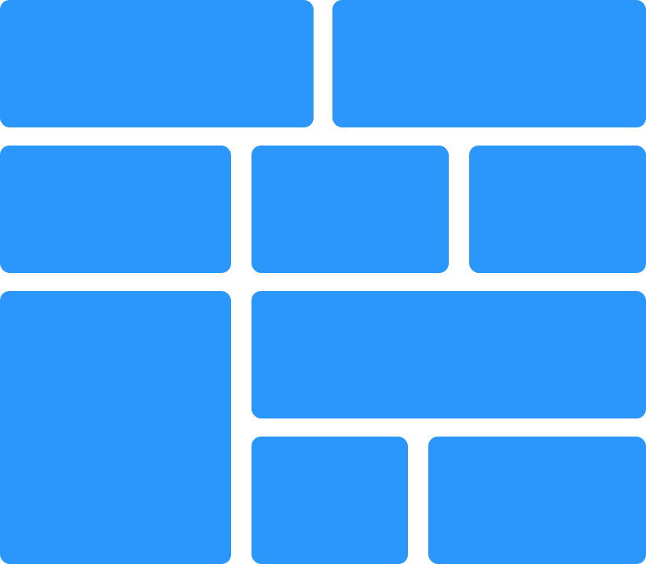

# KudoWall

> Virtual KudoWall implementation using VueJS and AWS.

## Features
* Customize kudos appearance.
* Fullscreen mode.
* Real-time.
* Offline capabilities.

## Requirements
* Create an AWS AppSync API.
* Copy AppSync credentials in your own .env.
* Configure AppSync [schema](https://github.com/dbalas/kudowall/blob/master/schema.graphql).
* Create Resources with an Amazon DynamoDB table.
* Configure DynamoDB [resolvers](https://github.com/dbalas/kudowall/blob/master/DYNAMODB_RESOLVERS.md).

## Built With
* [Vue.js](https://github.com/vuejs/vue) - Frontend framework used.
* [Bootstrap](https://github.com/twbs/bootstrap) - HTML and CSS framework used.
* [AWS AppSync](https://aws.amazon.com/appsync/) - Graphql service for data-driven apps with real-time and offline capabilities.
* [AWS DynamoDB](https://aws.amazon.com/dynamodb) - Nonrelational database.

## Contributing
Feel free to submit pull request or suggestions [here](https://github.com/dbalas/kudowall/issues/new).

## Contributors

* **Daniel Balastegui** - *Initial work* - [dbalas](https://github.com/dbalas)

## Versioning

We use [SemVer](http://semver.org/) for versioning. For the versions available, see the [tags on this repository](https://github.com/dbalas/devdome/tags).

## License

[MIT license](LICENSE.md).